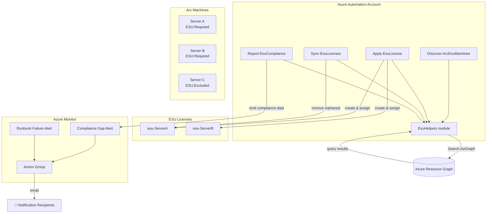

# Arc ESU Automation

Automates the full lifecycle of [Extended Security Updates (ESU)](https://learn.microsoft.com/azure/azure-arc/servers/deliver-extended-security-updates) for Azure Arc-connected Windows Server 2012/2012 R2 machines. The solution uses Azure Automation runbooks to **discover** eligible machines, **apply** ESU licenses, **sync** license state when machines are decommissioned or recommissioned, and **report** on compliance — all driven by Azure Resource Graph queries and resource tags.

## Architecture



## Prerequisites

| Requirement | Details |
|---|---|
| **Azure subscription** | With Azure Arc-connected Windows Server 2012/2012 R2 machines |
| **Azure CLI** | [Install](https://aka.ms/installazurecli) — used by the deployment script |
| **Az PowerShell modules** | `Az.Accounts`, `Az.ResourceGraph`, `Az.Resources`, `Az.ConnectedMachine`, `Az.Automation` |
| **RBAC permissions** | **Contributor** on the target resource group, **Connected Machine Resource Administrator** on subscriptions with Arc machines, **Monitoring Contributor** for alert setup |
| **Pester v5** | Required to run unit tests (`Install-Module Pester -MinimumVersion 5.0 -Force`) |

## Project Structure

```
arc-esu-automation/
├── infra/                          # Bicep infrastructure-as-code
│   ├── main.bicep                  # Orchestrator template
│   ├── modules/
│   │   ├── automation-account.bicep    # Automation Account with managed identity
│   │   ├── action-group.bicep          # Alert notification action group
│   │   └── monitor-alerts.bicep        # Compliance & failure alert rules
│   └── parameters/
│       ├── dev.bicepparam              # Dev environment parameters
│       └── prod.bicepparam             # Prod environment parameters
├── runbooks/                       # Azure Automation runbooks
│   ├── common/
│   │   └── EsuHelpers.psm1             # Shared helper module
│   ├── Discover-ArcEsuMachines.ps1     # Discover & tag eligible machines
│   ├── Apply-EsuLicense.ps1            # Create & assign ESU licenses
│   ├── Sync-EsuLicenses.ps1            # Reconcile licenses on decommission/recommission
│   └── Report-EsuCompliance.ps1        # Generate compliance report (JSON)
├── scripts/                        # Deployment & operational scripts
│   ├── Deploy-Infrastructure.ps1       # Deploy Bicep to Azure
│   └── Import-Runbooks.ps1             # Import & publish runbooks
├── tests/                          # Pester unit tests
├── requirements.md
└── README.md
```

## Deployment

### 1. Deploy infrastructure

The `Deploy-Infrastructure.ps1` script creates the resource group (if needed), deploys the Automation Account, Action Group, and Monitor Alerts via Bicep.

```powershell
# Preview changes first
.\scripts\Deploy-Infrastructure.ps1 `
    -ResourceGroupName "rg-esu-dev" `
    -Location "eastus" `
    -Environment dev `
    -WhatIf

# Deploy for real
.\scripts\Deploy-Infrastructure.ps1 `
    -ResourceGroupName "rg-esu-dev" `
    -Location "eastus" `
    -Environment dev
```

### 2. Import runbooks

After the Automation Account is deployed, import and publish the runbooks:

```powershell
.\scripts\Import-Runbooks.ps1 `
    -ResourceGroupName "rg-esu-dev" `
    -AutomationAccountName "aa-arc-esu-dev"
```

This imports all `.ps1` runbooks and the `EsuHelpers` shared module into the Automation Account.

### 3. Assign RBAC roles

The Automation Account's system-assigned managed identity needs:

- **Reader** on target subscriptions (for Resource Graph queries)
- **Tag Contributor** on subscriptions (for tagging machines)
- **Connected Machine Resource Administrator** on subscriptions (for license management)

## Runbooks

| Runbook | Purpose |
|---|---|
| **Discover-ArcEsuMachines** | Scans Arc machines for ESU-eligible OS versions (Windows Server 2012/2012 R2). Automatically tags discovered machines with `ESU:Required`. Produces a summary of newly tagged vs. already tagged machines. |
| **Apply-EsuLicense** | Creates and assigns ESU license resources to machines tagged `ESU:Required`. Detects OS edition (Standard/Datacenter), sets minimum core count, enables Software Assurance attestation. Skips already-licensed machines. |
| **Sync-EsuLicenses** | Reconciles license state against live machine status. **Decommission**: removes licenses from machines that no longer exist, are disconnected, or tagged `ESU:Excluded`. **Recommission**: identifies Connected machines needing licenses. Supports `-DryRun` for safe previewing. |
| **Report-EsuCompliance** | Produces a structured JSON compliance report with per-machine status (Compliant / NonCompliant / Orphaned / ExpiringSoon). Emits `Write-Error` alerts for non-compliant machines, suitable for Azure Monitor ingestion. |

## Configuration

### Tag conventions

Machines are governed by the `ESU` tag on `Microsoft.HybridCompute/machines` resources:

| Tag Value | Behavior |
|---|---|
| `ESU:Required` | Machine is included in license management (set automatically by discovery or manually) |
| `ESU:Excluded` | Machine is explicitly excluded — existing licenses are removed during sync |
| *(no tag)* | Machine is included if OS-based detection matches (Windows Server 2012/2012 R2) |

### Schedule configuration

After importing runbooks, create schedules in the Automation Account:

| Runbook | Recommended Schedule |
|---|---|
| Discover-ArcEsuMachines | Daily |
| Apply-EsuLicense | Daily (after discovery) |
| Sync-EsuLicenses | Daily |
| Report-EsuCompliance | Daily or hourly |

### Alert recipient configuration

Email recipients are configured in the Bicep parameter files (`infra/parameters/dev.bicepparam` or `prod.bicepparam`):

```bicep
param emailReceivers = [
  {
    name: 'DevTeam'
    emailAddress: 'dev-team@example.com'
  }
]
```

Two alert rules are deployed:
- **ESU Compliance Gap Alert** — fires when compliance gaps are detected (severity 2, hourly evaluation)
- **Runbook Failure Alert** — fires when any Automation runbook job fails

## Testing

Run the Pester test suite from the repository root:

```powershell
Invoke-Pester -Path ./tests -Output Detailed
```

> **Note:** Pester v5+ is required. Install with `Install-Module Pester -MinimumVersion 5.0 -Force`.

## Contributing

1. Fork the repository and create a feature branch.
2. Follow existing PowerShell coding conventions (comment-based help, `CmdletBinding`, verbose output).
3. Add or update Pester tests for any new or changed functionality.
4. Test changes locally with `-WhatIf` / `-DryRun` where available before submitting a pull request.

## License

This project is licensed under the [MIT License](LICENSE).