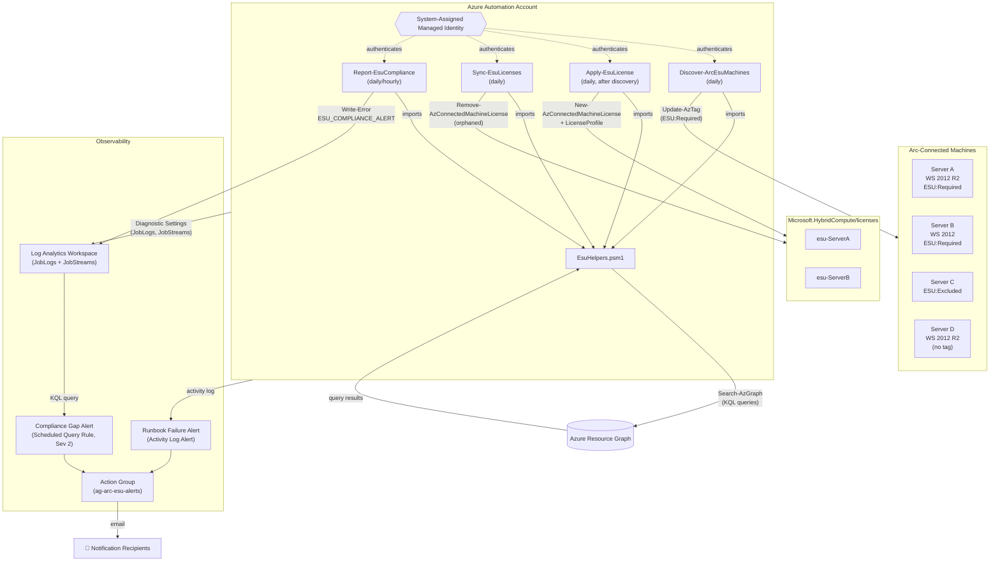
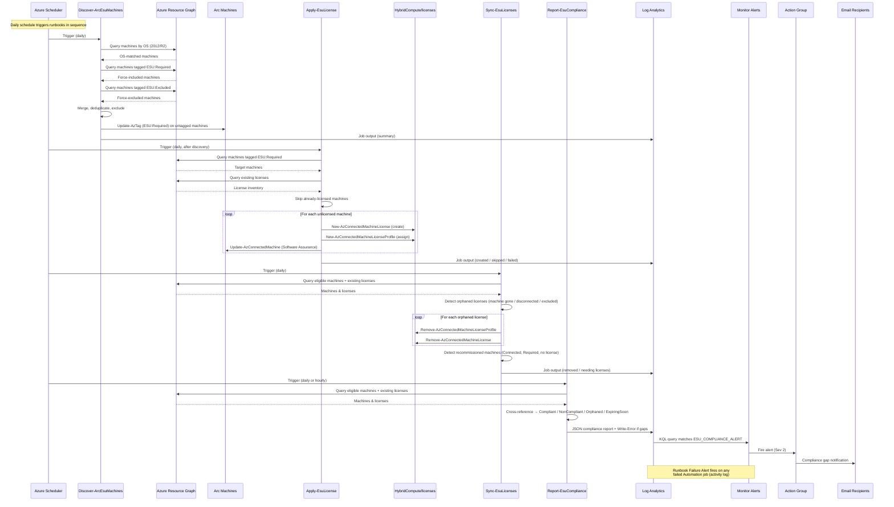

# Architecture — Arc ESU Automation

## 1. Overview

This solution automates the full lifecycle of [Extended Security Updates (ESU)](https://learn.microsoft.com/azure/azure-arc/servers/deliver-extended-security-updates) for Azure Arc-connected Windows Server 2012 and 2012 R2 machines. Four Azure Automation runbooks — backed by a shared helper module — **discover** eligible machines, **apply** ESU licenses, **sync** license state when machines are decommissioned or recommissioned, and **report** on compliance gaps. All machine queries flow through Azure Resource Graph, and all alerting is handled by Azure Monitor with email notifications via an Action Group.

---

## 2. Architecture Diagram



---

## 3. Component Overview

### 3.1 Shared Helper Module — `EsuHelpers.psm1`

The `runbooks/common/EsuHelpers.psm1` module is imported by every runbook and provides six functions:

| Function | Purpose |
|---|---|
| `Connect-AutomationAccount` | Authenticates to Azure via the system-assigned Managed Identity (`Connect-AzAccount -Identity`). |
| `Get-ArcMachinesByTag` | Queries Resource Graph for `Microsoft.HybridCompute/machines` filtered by a given tag name/value. Escapes single quotes in tag values to prevent KQL injection. |
| `Get-ArcMachinesByOs` | Queries Resource Graph for Arc machines whose `osName` or `osSku` contains `2012`. |
| `Get-EsuEligibleMachines` | Combines OS-based detection with tag overrides — force-includes `ESU:Required`, force-excludes `ESU:Excluded`, and deduplicates by resource ID. |
| `Get-ExistingEsuLicenses` | Queries Resource Graph for `Microsoft.HybridCompute/licenses` resources. |
| `Set-MachineEsuTag` | Applies (or updates) a tag on an Arc machine using `Update-AzTag` with a `Merge` operation. |

All Resource Graph queries use `[System.Collections.ArrayList]` with `SkipToken`-based pagination to handle arbitrarily large result sets.

### 3.2 Discovery Runbook — `Discover-ArcEsuMachines.ps1`

- **Purpose:** Identifies Arc machines eligible for ESU and tags them `ESU:Required`.
- **Trigger:** Scheduled daily.
- **Flow:** Calls `Get-EsuEligibleMachines` → iterates results → tags any machine not already tagged `ESU:Required` → outputs a structured summary (total eligible, newly tagged, already tagged).
- **Idempotent:** Safely re-runs — machines that already carry the tag are skipped.

### 3.3 Apply License Runbook — `Apply-EsuLicense.ps1`

- **Purpose:** Creates `Microsoft.HybridCompute/licenses` resources and assigns them to tagged machines.
- **Trigger:** Scheduled daily (after discovery).
- **Flow:** Queries machines tagged `ESU:Required` (or accepts explicit `ResourceIds`) → checks existing licenses → for each unlicensed machine: detects OS edition (Standard/Datacenter), enforces an 8-core minimum, creates a license (`New-AzConnectedMachineLicense`), assigns it (`New-AzConnectedMachineLicenseProfile`), and enables Software Assurance attestation.
- **Idempotent:** Skips machines that already have a license assignment.

### 3.4 Sync Licenses Runbook — `Sync-EsuLicenses.ps1`

- **Purpose:** Reconciles license state against live machine state.
- **Trigger:** Scheduled daily.
- **Decommission detection:** Finds licenses assigned to machines that no longer exist, are disconnected/expired, or are tagged `ESU:Excluded`. Removes the license assignment and then the license resource.
- **Recommission detection:** Finds eligible, Connected machines tagged `ESU:Required` that lack a license. Outputs their resource IDs for the Apply runbook.
- **Safety:** Supports a `-DryRun` switch that reports planned changes without executing them.

### 3.5 Compliance Report Runbook — `Report-EsuCompliance.ps1`

- **Purpose:** Produces a structured JSON compliance report and emits alerts for gaps.
- **Trigger:** Scheduled daily or hourly.
- **Categories:** Compliant, NonCompliant, Orphaned, ExpiringSoon (≤ 30 days to expiration).
- **Alerting:** Emits `Write-Error "ESU_COMPLIANCE_ALERT: …"` when non-compliant machines exist, which flows through diagnostic settings into Log Analytics and triggers the Compliance Gap Alert rule.

### 3.6 Infrastructure (Bicep)

| Module | Resource(s) | Purpose |
|---|---|---|
| `main.bicep` | Orchestrator | Wires all modules together; accepts parameters (name, location, email receivers, tags). |
| `automation-account.bicep` | `Microsoft.Automation/automationAccounts` + `Microsoft.Insights/diagnosticSettings` | Creates the Automation Account with a system-assigned Managed Identity. Streams `JobLogs` and `JobStreams` to Log Analytics. |
| `log-analytics.bicep` | `Microsoft.OperationalInsights/workspaces` | Creates the Log Analytics workspace (PerGB2018 SKU, 30-day default retention). |
| `action-group.bicep` | `Microsoft.Insights/actionGroups` | Configures email notification receivers. |
| `monitor-alerts.bicep` | `Microsoft.Insights/scheduledQueryRules` + `Microsoft.Insights/activityLogAlerts` | Two alert rules — **Compliance Gap** (log-based, severity 2, hourly) and **Runbook Failure** (activity-log-based, any job failure). Both fire to the Action Group. |

---

## 4. Data Flow



---

## 5. Machine Identification Strategy

The solution uses a **dual-approach** to identify ESU-eligible Arc machines:

### 5.1 OS-Based Detection (Primary)

`Get-ArcMachinesByOs` queries Azure Resource Graph for `Microsoft.HybridCompute/machines` where `properties.osName contains '2012'` or `properties.osSku contains '2012'`. This automatically captures any Arc-connected Windows Server 2012 or 2012 R2 machine without requiring manual intervention.

### 5.2 Tag-Based Overrides

| Tag | Effect |
|---|---|
| `ESU:Required` | **Force-include** — the machine is treated as ESU-eligible regardless of OS detection. Useful for machines with ambiguous OS metadata or non-standard configurations. |
| `ESU:Excluded` | **Force-exclude** — the machine is removed from the eligible set even if OS detection matches. Used for machines that are intentionally not receiving ESU (e.g., scheduled for decommission, covered by another mechanism). |
| *(no ESU tag)* | Machine is included only if OS-based detection matches. |

### 5.3 Combination Logic (`Get-EsuEligibleMachines`)

1. **Step 1 — OS detection:** Query machines by OS version → set `osMachines`.
2. **Step 2 — Force-include:** Query machines tagged `ESU:Required` → set `forceInclude`.
3. **Step 3 — Force-exclude:** Query machines tagged `ESU:Excluded` → build `excludedIds` hash set.
4. **Step 4 — Merge and deduplicate:** Concatenate `osMachines + forceInclude`, iterate once, skip any ID in `excludedIds` or already seen → produce final `eligible` list.

This ensures that tag overrides always win: `ESU:Excluded` can suppress an OS-matched machine, and `ESU:Required` can include a machine that OS detection missed.

---

## 6. Security Model

### 6.1 System-Assigned Managed Identity

The Automation Account uses a **system-assigned Managed Identity** for all Azure API calls. No credentials, secrets, or service principal passwords are stored. Authentication is handled by `Connect-AzAccount -Identity` (wrapped in `Connect-AutomationAccount`).

### 6.2 Required RBAC Roles

The Managed Identity must be granted the following roles on every subscription containing Arc machines:

| Role | Purpose |
|---|---|
| **Reader** | Allows Resource Graph queries against subscriptions. |
| **Tag Contributor** | Allows `Update-AzTag` to set the `ESU` tag on Arc machines. |
| **Connected Machine Resource Administrator** | Allows creating/removing `Microsoft.HybridCompute/licenses` and `licenseProfiles`, and updating machine properties (Software Assurance). |

### 6.3 KQL Injection Prevention

`Get-ArcMachinesByTag` escapes single quotes in tag name and value parameters before interpolating them into KQL queries:

```powershell
$escapedTagName  = $TagName.Replace("'", "''")
$escapedTagValue = $TagValue.Replace("'", "''")
```

This prevents malicious or unexpected tag values from breaking out of the KQL string literal and injecting arbitrary query logic.

---

## 7. Design Decisions

### 7.1 Azure Automation over Azure Functions

**Decision:** Use Azure Automation with PowerShell runbooks.

**Rationale:** The workload is a set of scheduled, stateless management scripts — not event-driven or latency-sensitive. Azure Automation provides built-in scheduling, managed identity integration, job logging to Log Analytics, and native support for Az PowerShell modules without requiring a build/deploy pipeline. Functions would add unnecessary complexity (function app hosting, deployment slots, cold-start management) for what is essentially a set of cron jobs.

### 7.2 Azure Resource Graph over Direct ARM Queries

**Decision:** Use `Search-AzGraph` for all machine and license discovery.

**Rationale:** Resource Graph provides cross-subscription, indexed queries with sub-second response times and KQL filtering. Direct ARM queries (`Get-AzResource`, `Get-AzConnectedMachine`) would require iterating over every subscription and resource group individually, resulting in O(subscriptions × resource groups) API calls, throttling risk, and significantly slower execution. Resource Graph handles pagination via `SkipToken` and returns a unified result set.

### 7.3 Tag-Based Overrides Alongside OS Detection

**Decision:** Support both automatic OS detection and manual `ESU:Required` / `ESU:Excluded` tags.

**Rationale:** OS detection covers the common case (Windows Server 2012/R2), but real environments have edge cases: machines with custom OS metadata, machines that should be excluded despite matching (e.g., test servers), or non-2012 machines that need ESU for other reasons. Tags give operators explicit override control without modifying code.

### 7.4 Idempotent Runbooks

**Decision:** Every runbook is safe to re-run without side effects.

**Rationale:** Automation schedules may fire multiple times (retries, overlapping schedules, manual triggers). Each runbook checks existing state before acting — Discovery skips already-tagged machines, Apply skips already-licensed machines, Sync only removes genuinely orphaned licenses. This eliminates duplicate resource creation and prevents accidental data loss.

### 7.5 ArrayList over Array Concatenation for Pagination

**Decision:** Use `[System.Collections.ArrayList]::new()` with `AddRange()` for paginated Resource Graph results.

**Rationale:** PowerShell's `+=` on arrays creates a new array and copies all elements on every append — O(n²) for n total results. `ArrayList.AddRange()` appends in amortized O(1) per element. For large environments with thousands of Arc machines or licenses, this avoids significant memory churn and execution time. The helper module uses this pattern consistently in `Get-ArcMachinesByTag`, `Get-ArcMachinesByOs`, and `Get-ExistingEsuLicenses`.

### 7.6 Cross-Reference Approach for Compliance (Not Machine-Level License Profile)

**Decision:** Determine compliance by cross-referencing the eligible machine list against the license list, rather than querying each machine's license profile individually.

**Rationale:** Querying `Microsoft.HybridCompute/machines/{name}/licenseProfiles` requires an individual ARM call per machine — infeasible at scale. Instead, `Report-EsuCompliance` fetches all eligible machines and all licenses via two Resource Graph queries, builds hash-table lookups by machine ID, and cross-references in-memory. This yields O(n + m) complexity (n machines, m licenses) with exactly two API calls regardless of fleet size, and also naturally identifies orphaned licenses (licenses pointing to non-eligible machines).
